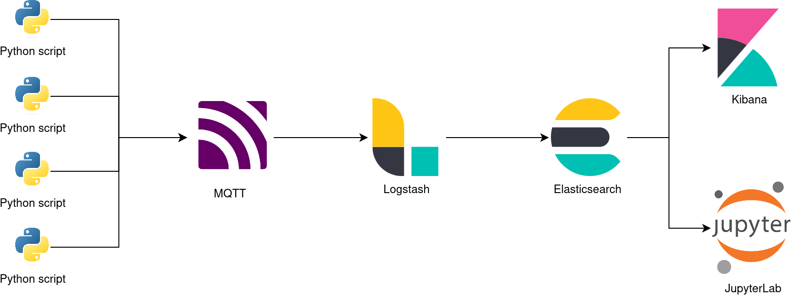

# Big Data Sensors Pipeline
This is an example of a Big Data Pipeline for processing simulated temperature sensor data.

Its implementation starts with an Elastic stack in docker compose, provided by this repository: https://github.com/deviantony/docker-elk, to which services were added for simulating data sources (a Python container), for creating an MQTT messaging layer (Mosquitto container, following this repository: https://github.com/vvatelot/mosquitto-docker-compose), and for extending the service layer provided by Kibana, with custom Python visualization and query scripts, hosted on a JupyterLab container.



## Start Pipeline
- Start the pipeline with docker-compose:
    ```bash
    docker-compose up
    ```

## Data Sources
- Check the logs of python docker container:
    ```bash
    docker logs --follow bd-sensors
    ```
- Probe MQTT from your local machine
    ```bash
    sudo apt update
    sudo apt install mosquitto-clients
    ```
    ```bash
    mosquitto_sub -h localhost -t sensors/temperature
    ```

## Data Ingestion
- Visualize the pipeline, located in "[path-to-this-project]/logstash/pipeline/logstash.conf"
- Let's see what happens behind the scenes, watch the logs of logstash docker container:
    ```bash
    docker logs --follow bd-logstash
    ```

## Visualization
### Discover
- Go to "Discover" on the left panel and select data to display, such as "temperature" and "sensor_id"

### Visualize
- Go to "Visualize", "Create", "Lens"
    - Create a line visualization with X axis "Date Histogram" and Y axis "Average" for the temperature, with auto parameter for the period
    - Change the period to 1s
    - Change from "Average" to "Median"
    - Add a filter to Y axis to display only sensor with id "0"
- Import a Dashboard
    - On the left panel go to "Management", "Stack Management", "Kibana", "Saved objects" and import the Dashboard located in "[path-to-this-project]/kibana/dashboards/dashboard.ndjson"

## Querying and Custom Visualization
Run ```jupyter server list``` inside the jupyter container in order to initialize the web UI:
```bash
docker exec -it bd-jupyter jupyter server list
```
connect at the prompted site, changing the host with "localhost".
- Execute the Notebooks inside the folder "work"